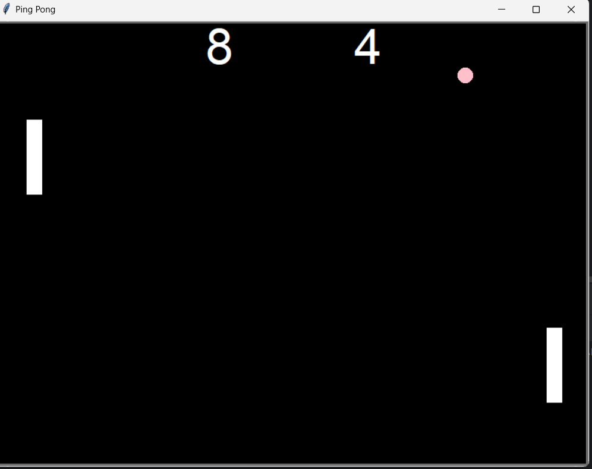

# Ping Pong Game

This is a simple implementation of the classic Ping Pong game using Python's `turtle` module. The game allows two players to control paddles and compete against each other in a fun and interactive way.

## Features

- **Two-Player Mode**: Control the left paddle using the "W" and "S" keys and the right paddle using the "Up" and "Down" arrow keys.
- **Ball Movement**: The ball moves across the screen, bouncing off walls and paddles.
- **Scoring System**: Points are awarded when a player misses the ball. The scoreboard updates automatically.
- **Collision Detection**: The ball bounces off the paddles and walls, simulating a real Ping Pong game.
- **Adjustable Ball Speed**: The ball speed increases each time it hits a paddle.

## How to Play

1. Clone the repository to your local machine.
2. Ensure you have Python installed on your system.
3. Run the `main.py` file using Python.
4. The left paddle is controlled by the "W" (up) and "S" (down) keys.
5. The right paddle is controlled by the "Up" (up) and "Down" (down) arrow keys.
6. The game continues until you close the window.

## Requirements

- Python 3.x
- Turtle module (comes pre-installed with Python)

## Files

- **`main.py`**: The main game loop and setup.
- **`paddle.py`**: Contains the `Paddle` class that handles paddle movement.
- **`ball.py`**: Contains the `Ball` class that manages ball movement and collision detection.
- **`scoreboard.py`**: Contains the `Scoreboard` class that manages the game score display.

## Future Improvements

- Add sound effects for ball collisions and scoring.
- Implement AI for single-player mode.
- Enhance graphics and animations.
## Screenshot

## License

This project is licensed under the MIT License. See the LICENSE file for more details.
